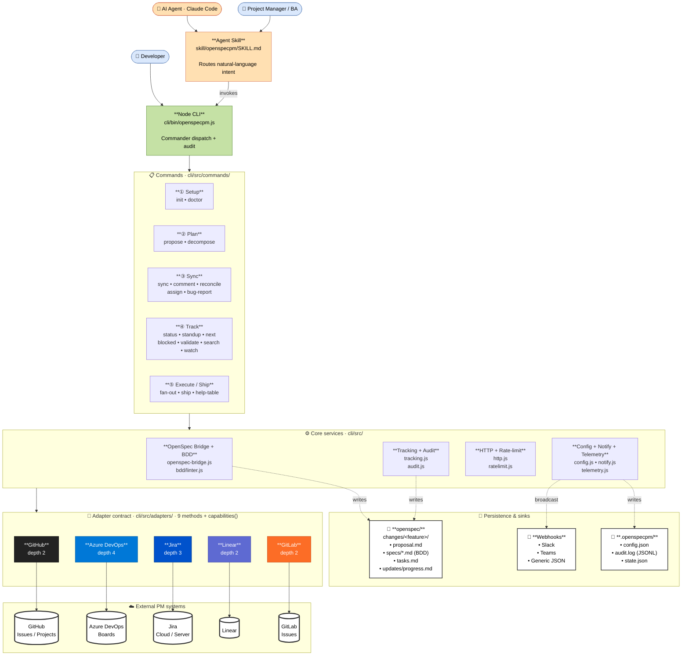
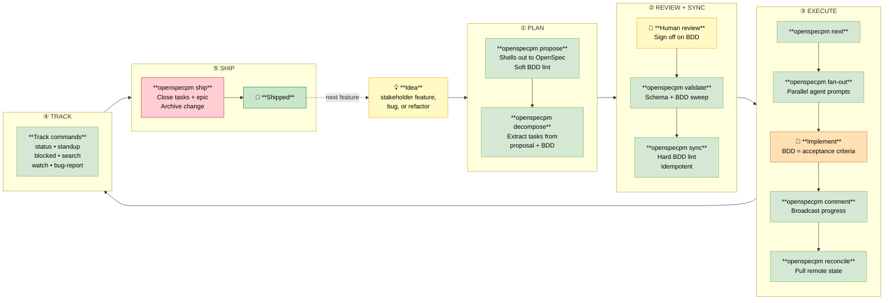

# OpenSpecPM — Spec-driven PM for any backend

[](https://github.com/aks-builds/openspecpm/actions/workflows/test.yml)
[](https://opensource.org/licenses/MIT)
[](cli/tests)

> Spec-driven, BDD-shaped project management for AI agents — author once in [OpenSpec](https://github.com/Fission-AI/OpenSpec), sync to GitHub Issues, Azure DevOps Boards, or Jira.

OpenSpecPM turns natural-language intent ("plan X", "sync the X epic", "what's blocked", "ship X") into a disciplined flow:

```
idea → proposal.md (OpenSpec) → BDD specs (Given/When/Then) → tasks
     → tracked work items (GitHub | ADO | Jira) → shipped code
```

It is a sibling of [CCPM](https://github.com/automazeio/ccpm), with three differences:

1. **OpenSpec drives spec authoring** — every feature gets `proposal.md`, `design.md`, `tasks.md`, and a `specs/` folder of BDD scenarios.
2. **The PM tool is pluggable** — an interactive wizard at `init` time picks GitHub Issues/Projects, Azure DevOps Boards, or Jira.
3. **Built for non-engineers too** — PMs/BAs/PgMs can drive the flow. A `doctor` command owns auth-setup pain. Worktrees are hidden by default.

## Install

```bash
# Standalone CLI (any harness)
npx openspecpm@latest init

# Claude Code Agent Skill
# Copy skill/openspecpm/ into your Claude Code skills directory.
# SKILL.md handles routing — just talk to Claude.
```

OpenSpecPM shells out to [OpenSpec](https://github.com/Fission-AI/OpenSpec); install it first:

```bash
npm install -g @fission-ai/openspec
```

## Quick start

```bash
# 1. One-time setup. The wizard asks which PM tool your team uses.
npx openspecpm init

# 2. Verify auth before doing anything remote.
npx openspecpm doctor

# 3. Author a proposal. OpenSpec generates proposal.md, design.md, tasks.md,
#    and BDD scenarios in specs/. Soft BDD-lint runs after authoring.
npx openspecpm propose dark-mode --prompt "Per-user dark theme with persistence."

# 4. Review the generated files. Refine BDD scenarios until lint is clean.

# 5. Sync to the PM tool. Hard BDD lint runs first; pass --force to override.
npx openspecpm sync dark-mode

# 6. Pick up where you left off.
npx openspecpm next        # tasks ready to start
npx openspecpm blocked     # tasks waiting on dependencies
npx openspecpm standup     # progress updates in the last 24h

# 7. When the feature is verified, close + archive.
npx openspecpm ship dark-mode
```

## Command reference

| Command | What it does |
|---|---|
| `init` | Interactive wizard. Picks the PM tool. Writes `.openspecpm/config.json`. |
| `doctor [adapter]` | Auth/tooling health check. English remediation hints on every failure. |
| `propose <feature>` | Shell out to OpenSpec; create `openspec/changes/<feature>/`. Soft-lint BDD scenarios. |
| `decompose <feature>` | Extract tasks from proposal headings/checklists + BDD scenarios into `tasks.md`. |
| `sync <feature>` | Hard-lint BDD, then create/update work items in the PM tool. Idempotent. |
| `comment <feature> <task>` | Broadcast local `progress.md` (or `-m`) to the PM tool with `<!-- SYNCED -->` marker. |
| `reconcile <feature>` | Pull remote work-item state into local frontmatter. Detects out-of-band closes. |
| `bug-report <feature> <task> --title "…"` | File a linked regression against a shipped task. |
| `status` | Per-change task counts: pending / created / failed / done. |
| `standup [--since 24h]` | Recent `progress.md` updates, newest first. |
| `next [-l 5]` | Tasks with no unmet dependencies. |
| `blocked` | Tasks waiting on unmet dependencies (with reasons). |
| `validate` | Schema + dependency + BDD-lint sweep across every change. |
| `search <query>` | Grep across proposals, specs, tasks, progress notes. |
| `fan-out <feature>` | Emit ready-to-paste agent prompts for `parallel: true` tasks. |
| `ship <feature> [-y]` | Close all task work items + close the epic + archive the OpenSpec change. |
| `help-table [topic]` | Context-aware command reference grouped by workflow phase. |

Every command appends a JSONL entry (secrets scrubbed) to `.openspecpm/audit.log`.

## Architecture



## Lifecycle



> Cross-cutting on every command: audit log (`.openspecpm/audit.log`, secrets scrubbed) · token-bucket rate-limiting per adapter · OpenSpec version probe · optional opt-in telemetry.

## Workflow phases

OpenSpecPM is organized into five phases, each with a reference doc under [`skill/openspecpm/references/`](skill/openspecpm/references/):

1. **Plan** ([`plan.md`](skill/openspecpm/references/plan.md)) — Capture requirements through an OpenSpec proposal + BDD scenarios.
2. **Structure** ([`structure.md`](skill/openspecpm/references/structure.md)) — Decompose into tasks with explicit dependencies and parallelism hints.
3. **Sync** ([`sync.md`](skill/openspecpm/references/sync.md)) — Push to the PM tool. Capabilities-driven hierarchy collapse for flatter backends.
4. **Execute** ([`execute.md`](skill/openspecpm/references/execute.md)) — Start work on a tracked item. Optional worktrees, parallel-agent dispatch.
5. **Track** ([`track.md`](skill/openspecpm/references/track.md)) — Status, standup, next, blocked, ship.

## Architecture highlights

- **Adapter contract.** Every backend implements the same 9-method interface plus `capabilities()` reporting hierarchy depth (GitHub=2, Jira=3, ADO=4). The sync layer collapses levels gracefully.
- **OpenSpec anti-corruption layer.** Version-pinned probe on every CLI invocation. One constant absorbs upstream path moves.
- **Idempotent sync.** Each task carries `sync_state` + `external_id` in frontmatter. Re-running `sync` skips created items and retries failures. Comments use `<!-- SYNCED: <ts> -->` markers to prevent duplication.
- **Token-bucket rate-limiting.** Per-adapter presets tuned for each backend's published limits.
- **BDD linter.** Heuristic checks: one Given/When/Then per scenario, observable verbs in Then, deny-list for vague phrases ("should work"), tautology detection via word-bigram similarity.

## Project structure

```
openspecpm/
├── README.md              this file
├── LICENSE                MIT
├── CHANGELOG.md
├── package.json
├── .github/workflows/test.yml
├── skill/openspecpm/      Claude Code Agent Skill
│   ├── SKILL.md
│   └── references/        conventions, plan, structure, sync, execute, track
└── cli/
    ├── bin/openspecpm.js  Commander entrypoint
    ├── src/
    │   ├── commands/      init, doctor, propose, sync, status, standup, next, blocked, ship
    │   ├── adapters/      base, github, azure, jira, index
    │   ├── bdd/           linter, templates
    │   ├── http.js        REST helper for ADO + Jira
    │   ├── tracking.js    listChanges, findNext, findBlocked, findRecent
    │   ├── openspec-bridge.js
    │   ├── config.js
    │   ├── frontmatter.js
    │   └── ratelimit.js
    └── tests/             unit + contract tests (count badge is auto-updated by CI)
```

## License

[MIT](LICENSE)
